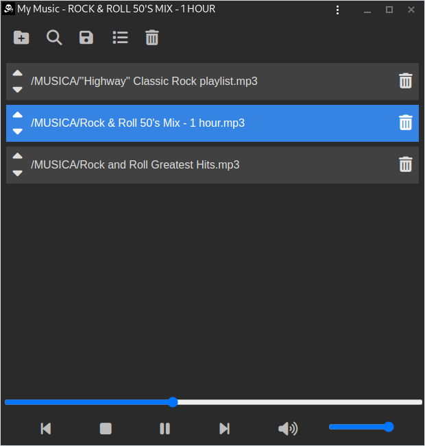
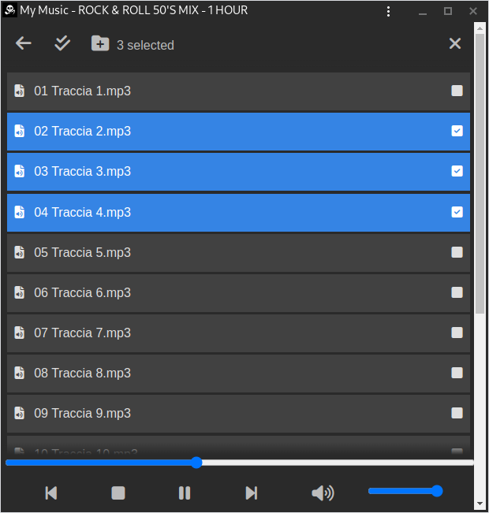
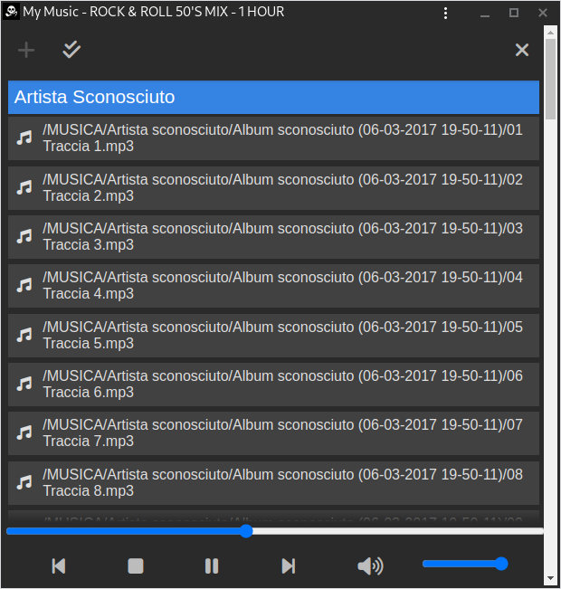
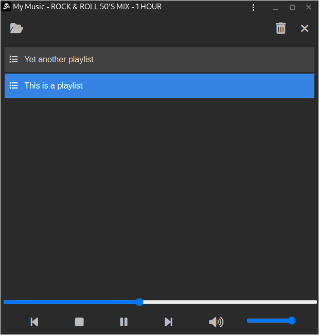

# Music Player PWA

**A plain, static, stupid web page that works as a native audio player.**


## Description

This application can be hosted on any webserver along with your mp3 files.
It does not require an application server, just static web hosting.

As a Progressive Web App, it can be "installed" on mobile phones and provides
[MediaSession](https://developer.mozilla.org/en-US/docs/Web/API/MediaSession)
controls on any compatible device, like desktop environments, smartwatches, 
bluetooth speakers, car stereo, etc. I use it in my everyday life and it works
bloody well.

It is currently tested and supported only on Chrome for Android. Currently waiting
for [Firefox Mobile support](https://bugzilla.mozilla.org/show_bug.cgi?id=1820020).
It could partially work on other platforms as well.

## Screenshots (desktop version)

1. the playlist view  

2. import files and directories  

3. search files by writing a text query  

4. save your playlists locally  



## Prerequisites

Upload some mp3 files on a webserver (e.g. an AWS S3 bucket). Once you have
them all under a base URL, get a list of all files and their full paths.

For example, if you are on a Linux server and your music is under `/var/www/html/Music`:
```sh
cd /var/www/html
find Music > /tmp/mylist.txt
```

Alternatively, on AWS S3 (provided you already have your `~/.aws` config and credentials)
```sh
aws s3 --region eu-south-1 ls --recursive <your-bucket-name>
# same command but using docker and avoid installing the AWS CLI
sudo docker run --rm -it -v ~/.aws:/root/.aws amazon/aws-cli s3 --region eu-south-1 ls --recursive <your-bucket-name>
```

Once you have your list, keep it at hand, you will need it soon.

## Setup

1. install dependencies
    ```sh
    yarn install
    ```
2. create `.env` file and edit appropriately
    ```sh
    cp .env.example .env
    ```
3. create `public/database.json` with your file list
    ```json
    [
        "/Music/Path/To/Some/Audio/File.mp3",
        "/Music/Path/To/Another/Audio/File.mp3"
    ]
    ```

## Development
```sh
# bind to localhost
yarn dev
# or bind to 0.0.0.0
yarn dev-public
```


## Build
```sh
yarn build
```
Output will be written to a `./dist` directory.

## Deploy
Just copy the `./dist` directory to some webserver - ideally, to the same place
where you already have your mp3 files.

If you use an AWS S3 bucket, you can deploy with one command:

```sh
./deploy.sh
```

## Notes

This code is messy and needs lots of improvements. The current release is just
the result of trying out vuejs 3 for the first time. Find some improvements
[TODO](TODO.md)